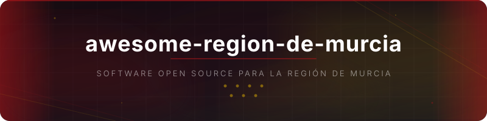

<h1 align="center">
  <a href="https://github.com/GeiserX/awesome-region-de-murcia"></a>
  <br><br>
  <a href="https://awesome.re"></a>
  <br><br>
  <p>Una selección de software open source que da soporte específico a la Región de Murcia, sus municipios, universidades e instituciones.</p>
</h1>

## Contenido

<!--lint disable awesome-list-item-->

- [Administración y Gobierno Regional](#administración-y-gobierno-regional)
- [Cultura y Patrimonio](#cultura-y-patrimonio)
- [Datos Abiertos y Estadísticas](#datos-abiertos-y-estadísticas)
- [Deportes](#deportes)
- [Medio Ambiente y Mar Menor](#medio-ambiente-y-mar-menor)
- [Playas y Costa](#playas-y-costa)
- [Transporte y Movilidad](#transporte-y-movilidad)
- [Universidad e Investigación](#universidad-e-investigación)

<!--lint enable awesome-list-item-->

## Administración y Gobierno Regional

- [BORM](https://github.com/carm-es/BORM) - Servicio web de actualización de firma para el Boletín Oficial de la Región de Murcia.
- [Chatbot EOI](https://github.com/carm-es/chatbot-eoi) - Chatbot para la Escuela de la Administración Regional de Murcia basado en Python.
- [CSV Storage CARM](https://github.com/carm-es/csvstorage) - Almacenamiento y gestión de códigos seguros de verificación de documentos electrónicos de la CARM.
- [Eeutil-Firma](https://github.com/carm-es/eeutil-firma) - Servicio de firma electrónica de documentos para la administración electrónica de la CARM.
- [Eeutil-Misc](https://github.com/carm-es/eeutil-misc) - Validación ENI de documentos y expedientes electrónicos para la CARM.
- [Eeutil-Oper-Firma](https://github.com/carm-es/eeutil-oper-firma) - Operaciones de validación de firma y certificados electrónicos para la CARM.
- [Eeutil-Shared](https://github.com/carm-es/eeutil-shared) - Módulos comunes compartidos por los componentes Eeutil de la Suite Inside de la CARM.
- [Eeutil-Util-Firma](https://github.com/carm-es/eeutil-util-firma) - Generación de códigos seguros de verificación a partir de firmas electrónicas para la CARM.
- [Eeutil-Vis-DocExp](https://github.com/carm-es/eeutil-vis-docexp) - Visualización de documentos y expedientes electrónicos en PDF para la CARM.
- [Guías CARM](https://github.com/carm-es/guias) - Guías de desarrollo de aplicaciones, buenas prácticas y CI/CD para proyectos de la CARM.
- [InSiDE CARM](https://github.com/carm-es/inside) - Instalación de InSiDE (Infraestructura y Sistemas de Documentación Electrónica) de la CARM.
- [REST-LDAP CARM](https://github.com/carm-es/rest-ldap) - Aplicación web para consulta de usuarios en OpenLDAP mediante servicio REST para la CARM.
- [SICI CARM](https://github.com/ffis/sici) - Sistema Integrado de Control de Indicadores para el seguimiento de cartas de servicios de la CARM.
- [Transparencia CARM](https://github.com/marsolmos/transparencia-carm) - Herramienta de transparencia para contratos públicos del Gobierno de la Región de Murcia.

## Cultura y Patrimonio

- [Diccionario Panocho](https://github.com/pedrosc1967/diccionario_panocho) - Aplicación de diccionario del panocho, dialecto tradicional de la Huerta de Murcia.
- [Molino Lo Negrete](https://github.com/aconesac/molino-lo-negrete) - Sitio web para la restauración y difusión del Molino de Viento Lo Negrete de Cartagena.
- [Rutas de Cartagena](https://github.com/victoskyct/shiny_rutas_ct) - Aplicación Shiny para consultar y descargar rutas de senderismo de Cartagena.

## Datos Abiertos y Estadísticas

- [Murcia Tech Hub](https://github.com/MurciaDev/murcia-tech-hub) - Directorio de empresas tecnológicas de la Región de Murcia con información sobre trabajo remoto y stacks.
- [PMP Murcia](https://github.com/MurciaLab/PMP) - Monitorización del estado de proyectos anunciados para la ciudad de Murcia.
- [Seguimiento Murcia](https://github.com/MurciaLab/seguimiento) - Seguimiento visual de propuestas y proyectos de desarrollo de la ciudad de Murcia por MurciaLab.

## Deportes

- [App Contador Acciones Real Murcia](https://github.com/KikeOnRails/AppContadorAccionesRealMurcia) - Contador de acciones del Real Murcia CF.
- [Checklist Real Murcia](https://github.com/Renilla/checklist-real-murcia) - Aplicación web de checklist de cromos del Real Murcia CF.
- [Contador Abonados Real Murcia](https://github.com/ManuelFranco/contadorAbonados) - Scraper visual de la cuenta de abonados del Real Murcia CF.

## Medio Ambiente y Mar Menor

- [AquaSense Cloud](https://github.com/juanfranciscomanzanares/aquasense-cloud) - Plataforma serverless en AWS para monitorización de temperatura del Mar Menor con alertas automáticas.
- [Avistamientos Aves Mar Menor](https://github.com/lucyleia28/AvistamientosAvesMarMenor) - Plugin de web aumentada para Wikipedia que muestra avistamientos de aves en el Mar Menor y datos de calidad del agua.
- [Eco3M-MAR_MENOR](https://github.com/ealvarez-s/Eco3M-MAR_MENOR) - Código y región para ejecutar el modelo biogeoquímico SYMPHONIE-Eco3M en la laguna del Mar Menor.
- [ICA Diario CARM](https://github.com/MurciaLab/ICA_Diario_2025) - Cálculo del Índice de Calidad del Aire diario a partir de datos horarios de la CARM.
- [Lost Frequencies Mar Menor](https://github.com/rubmoyanop/lost-frequencies-nasa-space-apps-challenge-2025) - Visor interactivo con datos Sentinel-1/2 para mapear contaminación y riesgo de inundación en el Mar Menor.
- [LULCMAP Mar Menor Watershed](https://github.com/Paquicf/LULCMAP-MarMenor_Watershed) - Serie temporal de mapas de usos del suelo de la cuenca del Mar Menor (1988-2009) generados con imágenes Landsat.
- [Mar Menor CHL](https://github.com/Antonio-MI/mar-menor-chl) - Mapeo y predicción de clorofila-a en el Mar Menor mediante imágenes Sentinel 2 y aprendizaje automático.
- [Mar Menor Digital Twin](https://github.com/yuye188/MarMenorDigitalTwin) - Gemelo digital del Mar Menor desarrollado por la Universidad de Murcia con interoperabilidad FIWARE.
- [Mar Menor FIWARE](https://github.com/mariete1223/MarMenor) - Sistema de consulta de datos de sensores del Mar Menor basado en FIWARE NGSI-LD con Orion Context Broker y Grafana.
- [Mar Menor Health Predictor](https://github.com/allepuzz/Mar-Menor-Health-Predictor) - Predictor de calidad del agua del Mar Menor usando Random Forest y SARIMA para clorofila, nitratos y fosfatos.
- [Mar Menor Status](https://github.com/NataliaPmd/mar_menor_status) - Panel de monitorización ecológica del Mar Menor con scrapers de fuentes oficiales como AEMET, IMIDA y UPCT.
- [Ocean-CTD](https://github.com/Raniita/Ocean-CTD) - Dispositivo CTD oceanográfico diseñado y utilizado por el grupo de investigación del Mar Menor de la UPCT.
- [SMARTLAGOON Buoy Data](https://github.com/SMARTLAGOON/SMLG_Buoy_Data) - Datos de monitorización ambiental de alta frecuencia de la boya SMARTLAGOON en el Mar Menor.

## Playas y Costa

- [Marine Forecast](https://github.com/SoniaRuiz/marine-forecast) - Previsión marítima para las zonas costeras de La Manga y Cartagena.
- [playasmurcia](https://github.com/jmlweb/playasmurcia) - Catálogo de playas de la Región de Murcia con datos abiertos de la CARM.

## Transporte y Movilidad

- [Aeropuerto Bus Realtime](https://github.com/KikeOnRails/aeropuerto-bus-realtime) - Horarios y geolocalización en tiempo real de la línea de autobús del Aeropuerto de Murcia.
- [BUS Murcia](https://github.com/KikeOnRails/busmurcia-app) - Aplicación Android de horarios en tiempo real de los autobuses de Murcia y pedanías con seguimiento en OpenStreetMap.

## Universidad e Investigación

- [Charla MCP](https://github.com/CenticMurcia/charla-mcp) - Material de la charla sobre Model Context Protocol impartida por CenticMurcia.
- [Curso Ciencia de Datos](https://github.com/CenticMurcia/curso-ciencia-datos) - Curso de ciencia de datos del Centro Tecnológico de las TIC de la Región de Murcia.
- [Data Science Python UPCT](https://github.com/mkesslerct/data_science_Python) - Curso de introducción a Data Science con Python de la UPCT.
- [docxtojats-pipeline](https://github.com/editum/docxtojats-pipeline) - Conversión de documentos DOC/DOCX a JATS XML con automarcado avanzado para EDITUM de la Universidad de Murcia.
- [HÉRCULES Sync](https://github.com/weso/hercules-sync) - Sincronización de ontologías con Wikibase para el proyecto HÉRCULES de infraestructura semántica de la Universidad de Murcia.
- [JATSWizard](https://github.com/editum/JATSWizard) - Plugin OJS de asistente guiado de conversión de DOCX a JATS XML para EDITUM de la Universidad de Murcia.
- [NLP Consentimientos Médicos](https://github.com/CenticMurcia/nlp-consentimientos-medicos) - Análisis de entendibilidad de consentimientos médicos mediante NLP por CenticMurcia.
- [Plantilla TFG FIUM](https://github.com/AnaAguilarI/Plantilla-TFG-FIUM) - Plantilla LaTeX actualizada para trabajos de fin de grado de la Facultad de Informática de la UMU.
- [Sierra Minera Spatial Dataset](https://github.com/TabErrans/sierra-minera-spatial-dataset) - Pipeline reproducible de integración de datos espaciales de suelos de la Sierra Minera de Cartagena-La Unión.
- [SmartEcoRutas](https://github.com/ppavon/smartEcoRutas) - Marco de optimización algorítmica de rutas de recogida de residuos urbanos en Cartagena para el Reto-UPCT.
- [The Explorer](https://github.com/javics2002/TheExplorer) - Videojuego educativo premiado sobre las pinturas rupestres de la Cañaica del Calar en Moratalla.
- [U-Schema](https://github.com/modelum/uschema) - Metamodelo unificado para integración de datos del grupo Modelum de la Universidad de Murcia.

## Insignia

Si tu proyecto aparece en esta lista, puedes añadir una de estas insignias a tu README para que la gente lo sepa.

<!--lint disable double-link-->

   

Flat (por defecto):
```markdown
[](https://github.com/GeiserX/awesome-region-de-murcia#readme)
```

Flat square:
```markdown
[](https://github.com/GeiserX/awesome-region-de-murcia#readme)
```

Plastic:
```markdown
[](https://github.com/GeiserX/awesome-region-de-murcia#readme)
```

For the badge (large):
```markdown
[](https://github.com/GeiserX/awesome-region-de-murcia#readme)
```

## Contribuir

Las contribuciones son bienvenidas. Lee las [directrices de contribución](contributing.md) antes de enviar un pull request.

## Nota

Esta lista se centra en software open source que da **soporte específico a la Región de Murcia** o que incluye funcionalidades relevantes para usuarios en esta comunidad autónoma. No se incluye software genérico solo por estar creado por desarrolladores murcianos.

## Descargo de responsabilidad

No se aceptan proyectos relacionados con pornografía, contenido NSFW, loterías o apuestas, religión, política partidista ni cualquier otro tema controvertido. Esta lista pretende ser un recurso técnico neutral y útil para la comunidad de desarrolladores.
